# CallPage Architecture Documentation

This document describes the architecture and behavior of the video call page, including the `CallPage.tsx` component and the `useCallSession` hook that powers it.

## Overview

The CallPage is the main view for an active video call. It displays:
- Local video preview (camera)
- Remote video from the other participant
- Status messages and error handling
- Connection status panel (expandable)
- Hangup button

The page is backed by the `useCallSession` hook, which manages all WebRTC and signaling logic.

---

## Component Structure

```
CallPage.tsx
├── useCallSession(callId)          # Main hook for all call logic
│   ├── RTCPeerConnection           # WebRTC peer connection
│   ├── SignalingClient (WebSocket) # Signaling for offer/answer/ICE
│   └── Media streams               # Local and remote MediaStreams
├── useVideoElement(localVideoRef)  # Binds local stream to video element
├── useVideoElement(remoteVideoRef) # Binds remote stream to video element
└── UI Components
    ├── Remote video container
    ├── Local video (floating)
    ├── Status overlay panel
    └── Bottom bar (hangup, status text)
```

---

## State Flow Diagram

The following diagram shows the main states and transitions during a call:

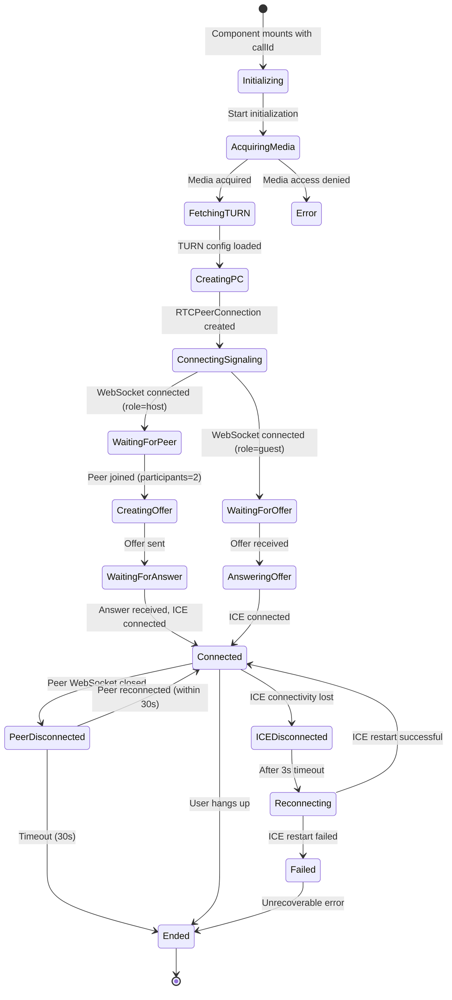

---

## Call Initialization Sequence

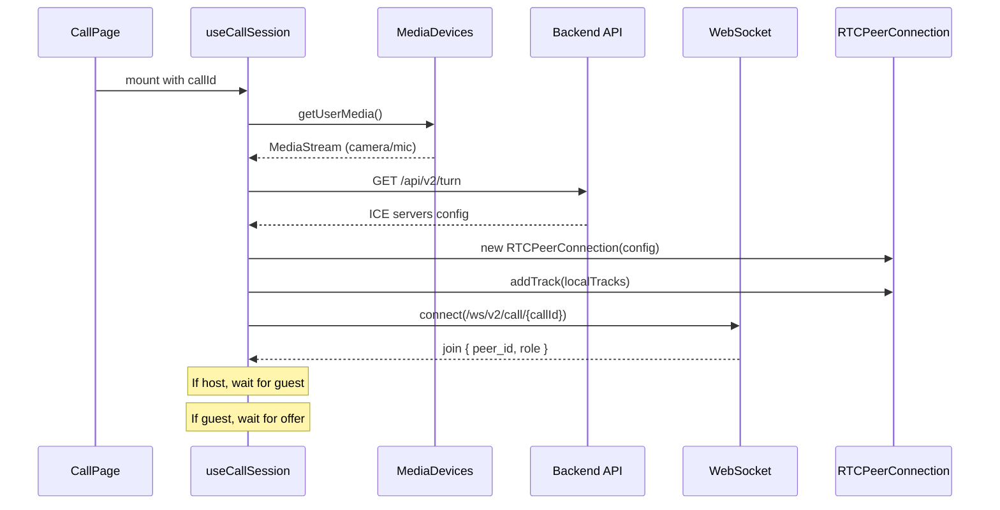

---

## WebRTC Offer/Answer Exchange

### Host Flow (creates offer)

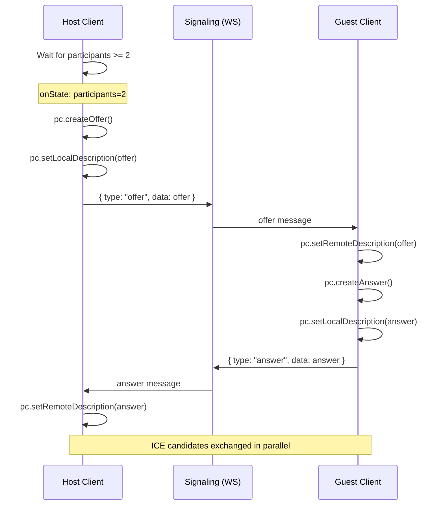

### ICE Candidate Exchange

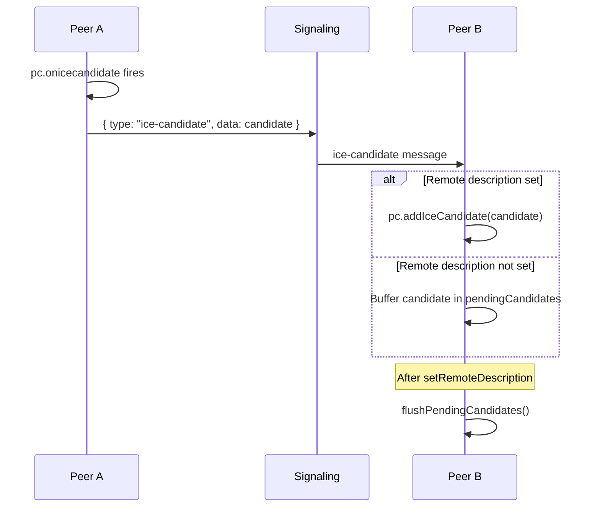

---

## Reconnection Handling

### ICE Reconnection (network change)

When ICE connectivity is lost (e.g., network switch), the system attempts ICE restart:

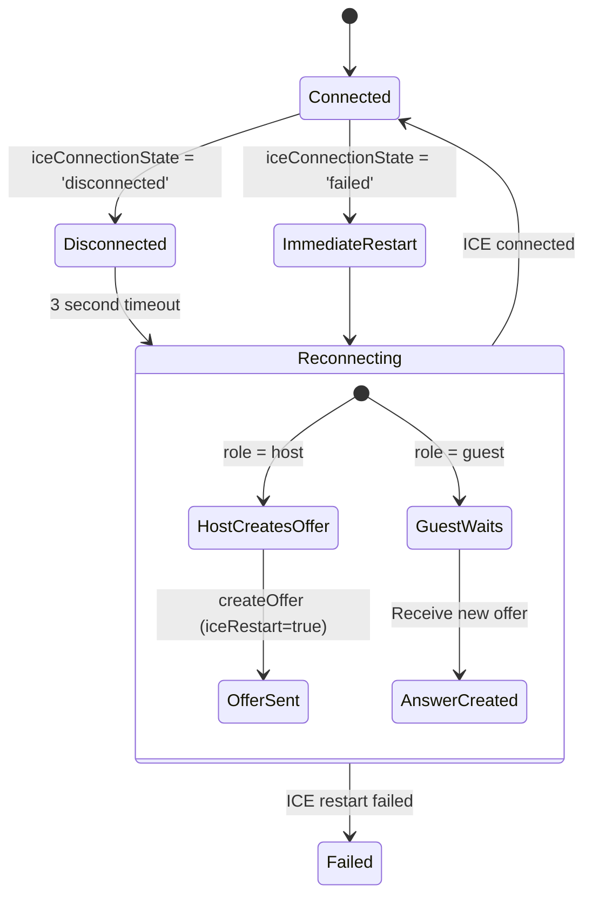

### Peer Disconnection (WebSocket)

When the remote peer's WebSocket disconnects:

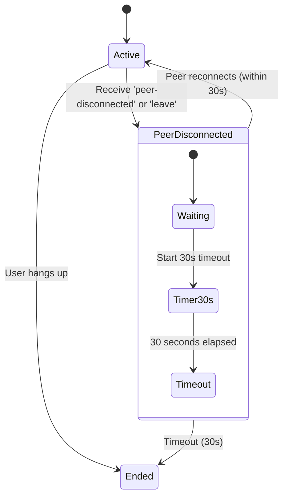

---

## State Variables Reference

### Connection State

| State Variable | Type | Description |
|---------------|------|-------------|
| `wsState` | `'connecting' \| 'reconnecting' \| 'ready' \| 'disconnected'` | WebSocket signaling connection state |
| `peerConnectionState` | `RTCPeerConnectionState \| 'new'` | Overall WebRTC connection state |
| `iceConnectionState` | `RTCIceConnectionState \| 'new'` | ICE connectivity state |
| `reconnectionState` | `'connected' \| 'reconnecting' \| 'peer-disconnected' \| 'failed'` | High-level reconnection state |

### Call State

| State Variable | Type | Description |
|---------------|------|-------------|
| `callStatus` | `'waiting' \| 'active' \| 'ended'` | High-level call status |
| `participants` | `number` | Number of participants (1 or 2) |
| `error` | `string \| null` | Error message to display |
| `transientMessage` | `string \| null` | Temporary status message |
| `peerDisconnected` | `boolean` | Remote peer disconnected flag |

### Media State

| State Variable | Type | Description |
|---------------|------|-------------|
| `localStreamState` | `MediaStream \| null` | Local camera/mic stream |
| `remoteStream` | `MediaStream \| null` | Remote peer's media stream |
| `mediaRoute` | `{ mode: MediaRouteMode; detail?: string }` | P2P or TURN relay indicator |

---

## UI Status Messages Priority

The `getInfoMessage()` function determines what message to show, with this priority:

1. **transientMessage** - One-time status messages (e.g., "Creating offer...")
2. **reconnectionState** - Reconnection/peer disconnect messages
3. **callStatus === 'ended'** - "Call ended"
4. **remoteStream exists** - "Remote video connected"
5. **Connection fully established** - "Connection established"
6. **Active call, connecting** - "Peer joined, establishing media..."
7. **Default** - "Preparing call..."

---

## Key Files

| File | Purpose |
|------|---------|
| [CallPage.tsx](../frontend/src/pages/CallPage.tsx) | Main UI component |
| [useCallSession.ts](../frontend/src/hooks/useCallSession.ts) | WebRTC and signaling logic |
| [useVideoElement.ts](../frontend/src/hooks/useVideoElement.ts) | Video element binding |
| [signaling.ts](../frontend/src/services/signaling.ts) | WebSocket signaling client |
| [media.ts](../frontend/src/services/media.ts) | Media stream management |
| [session.ts](../frontend/src/services/session.ts) | Session storage persistence |
| [uiConsts.ts](../frontend/src/hooks/uiConsts.ts) | UI constants and helpers |

---

## Error Handling

| Error Scenario | User Message | Recovery |
|---------------|--------------|----------|
| Media access denied | "Failed to access camera/microphone" | Return to start page |
| TURN config fetch failed | (warning only, continues) | Uses STUN only |
| WebRTC connection failed | "WebRTC connection failed" | Show error, suggest new call |
| ICE restart failed | "Failed to reconnect media session" | Show error, suggest new call |
| Guest without peerId | "Guest session not found" | Return via invitation link |
| Peer disconnected timeout | Call auto-ends | Redirect to home |

---

## Performance Considerations

1. **Refs for non-reactive state**: `pcRef`, `signalingRef`, `offerSentRef` etc. don't trigger re-renders
2. **Memoized callbacks**: All handlers use `useCallback` to prevent unnecessary re-renders
3. **Auto-cleanup**: Effect cleanup tears down WebRTC and signaling on unmount
4. **Buffered ICE candidates**: Candidates arriving before `setRemoteDescription` are queued
5. **Single offer guard**: `offerSentRef` prevents duplicate offer creation

---

## useCallSession Hook Internal Architecture

This section describes the internal implementation details of the `useCallSession` hook.

### Hook Structure Overview

The hook is organized into logical sections:

```
useCallSession(callId)
│
├── REACTIVE STATE (useState)
│   └── 14 state variables that trigger re-renders
│
├── REFS (useRef)
│   └── 7 refs for mutable non-reactive data
│
├── SYNC EFFECTS (useEffect)
│   └── Keep refs synchronized with state
│
├── UTILITY CALLBACKS (useCallback)
│   ├── resetMediaRoute()
│   └── resetPeerReconnection()
│
├── MEDIA ROUTE DETECTION
│   └── updateMediaRoute() - inspects RTCPeerConnection stats
│
├── SESSION TEARDOWN
│   └── teardownSession() - cleanup all resources
│
├── SIGNALING HELPERS
│   └── sendSignal() - send WebSocket messages
│
├── ICE RESTART
│   ├── performIceRestart() - host-initiated restart
│   └── handlePeerReconnected() - peer reconnection handler
│
├── SDP & ICE HANDLERS
│   ├── flushPendingCandidates()
│   ├── handleRemoteOffer()
│   ├── handleRemoteAnswer()
│   └── handleRemoteCandidate()
│
├── OFFER CREATION
│   └── createOfferRef - ref-based offer creation
│
├── EFFECTS
│   ├── Auto-offer effect (host only)
│   ├── Transient message cleanup
│   └── Main initialization effect
│
└── PUBLIC ACTIONS
    ├── hangup()
    └── setTransientMessage()
```

### Reactive State Variables

All state variables that trigger component re-renders:

```typescript
// Session metadata
const [sessionInfo, setSessionInfo] = useState<SessionState>()

// Connection states
const [wsState, setWsState] = useState<WSState>('connecting')
const [callStatus, setCallStatus] = useState<CallStatus>('waiting')
const [participants, setParticipants] = useState(1)
const [peerConnectionState, setPeerConnectionState] = useState<RTCPeerConnectionState | 'new'>('new')
const [iceConnectionState, setIceConnectionState] = useState<RTCIceConnectionState | 'new'>('new')

// Media
const [remoteStream, setRemoteStream] = useState<MediaStream | null>(null)
const [localStreamState, setLocalStreamState] = useState<MediaStream | null>()
const [mediaRoute, setMediaRoute] = useState<{ mode: MediaRouteMode; detail?: string }>()

// UI state
const [error, setError] = useState<string | null>(null)
const [transientMessage, setTransientMessage] = useState<string | null>(null)

// Reconnection
const [reconnectionState, setReconnectionState] = useState<ReconnectionState>('connected')
const [peerDisconnected, setPeerDisconnected] = useState(false)
```

### Mutable Refs (Non-Reactive)

Refs hold objects and values that shouldn't trigger re-renders:

```typescript
// WebRTC and signaling objects
const signalingRef = useRef<SignalingClient | null>(null)
const signalingSubscriptionRef = useRef<SignalingSubscription | null>(null)
const pcRef = useRef<RTCPeerConnection | null>(null)

// Buffered data
const pendingCandidatesRef = useRef<RTCIceCandidateInit[]>([])

// Guards and flags
const offerSentRef = useRef(false)  // Prevents duplicate offers

// Timers
const iceRestartTimerRef = useRef<ReturnType<typeof setTimeout> | null>(null)
const peerDisconnectTimerRef = useRef<ReturnType<typeof setTimeout> | null>(null)

// Role/peer info (to avoid stale closures)
const connectionParamsRef = useRef<{ peerId?: string; role: PeerRole }>()
```

### Key Callbacks Explained

#### `updateMediaRoute()`

Queries RTCPeerConnection statistics to determine how media is being routed:

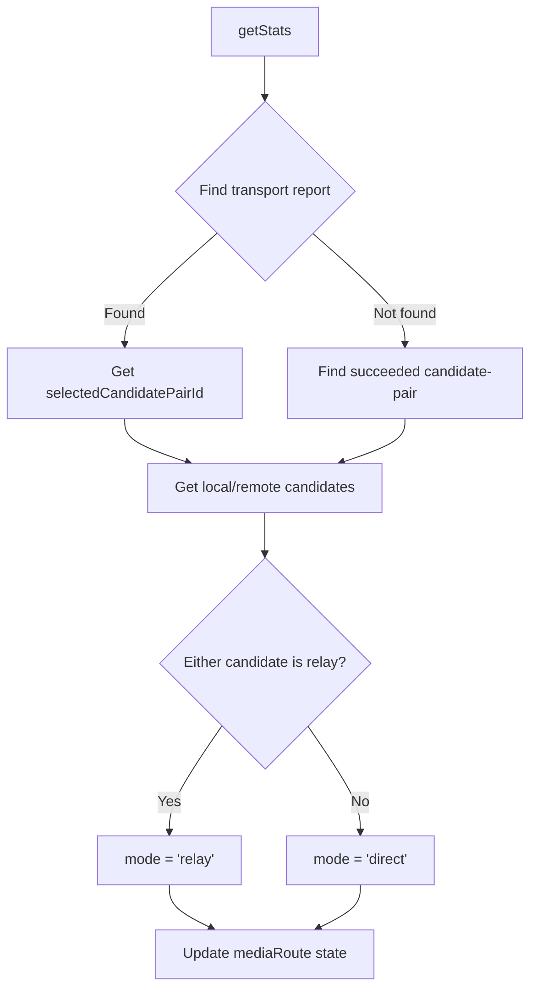

#### `teardownSession(options)`

Complete cleanup of all session resources:

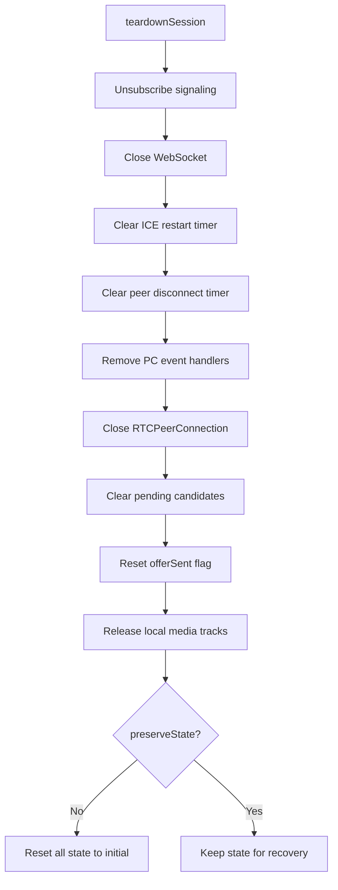

#### `performIceRestart()`

Handles ICE connectivity recovery:

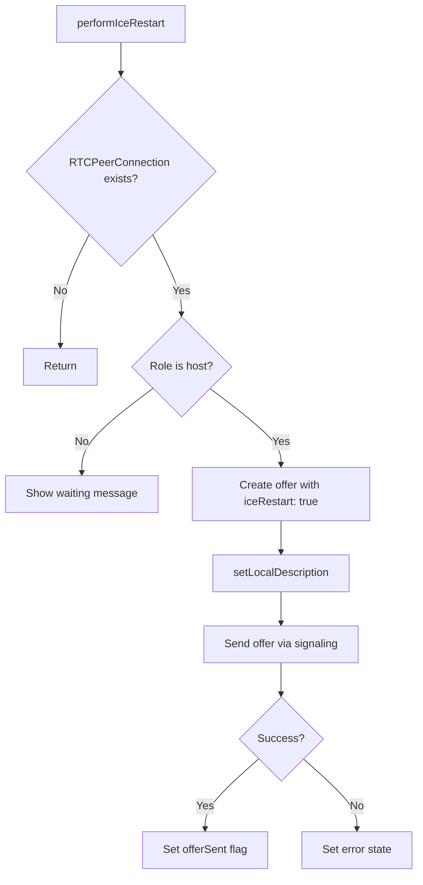

#### `handleRemoteOffer(description)`

Guest's response to receiving an SDP offer:

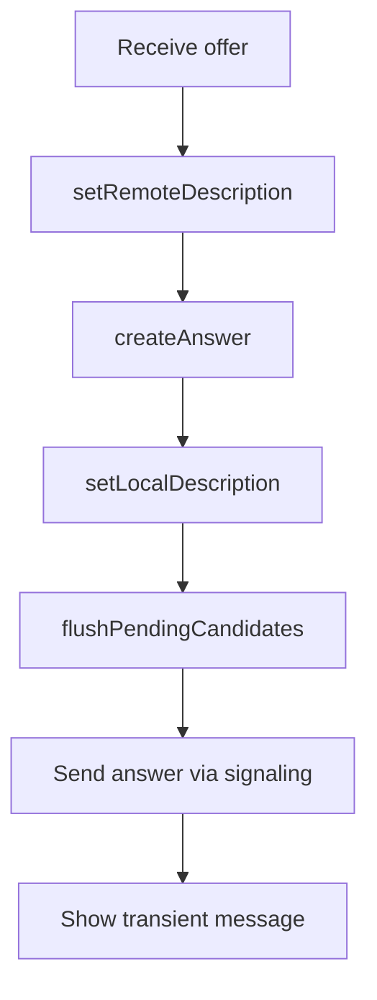

#### `handleRemoteCandidate(candidate)`

Handles incoming ICE candidates with buffering:

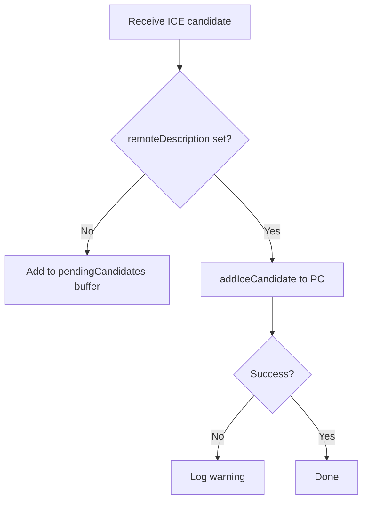

### Effects Explained

#### Sync Effect: `connectionParamsRef`

Keeps the ref synchronized with reactive `sessionInfo`:

```typescript
useEffect(() => {
  connectionParamsRef.current = {
    peerId: sessionInfo.peerId,
    role: sessionInfo.role ?? connectionParamsRef.current.role ?? 'host',
  };
}, [sessionInfo.peerId, sessionInfo.role]);
```

**Purpose**: Allows callbacks to read current role/peerId without stale closure issues.

#### Auto-Offer Effect

Automatically creates offer when all conditions are met:

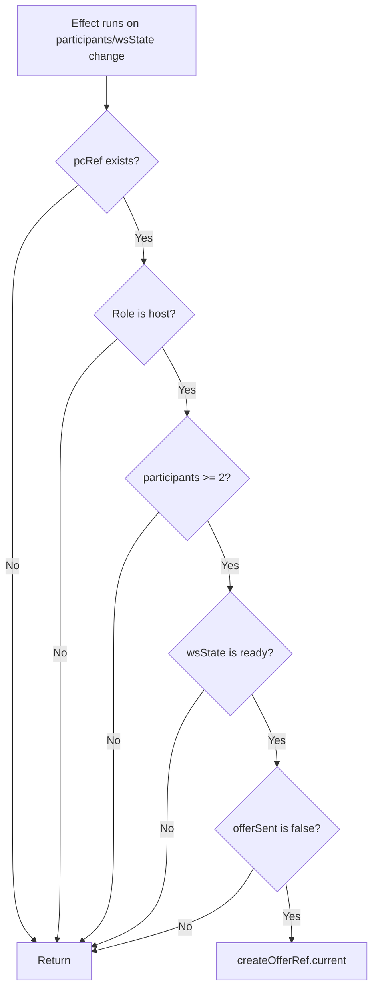

#### Transient Message Cleanup Effect

Auto-clears status messages when connection is established:

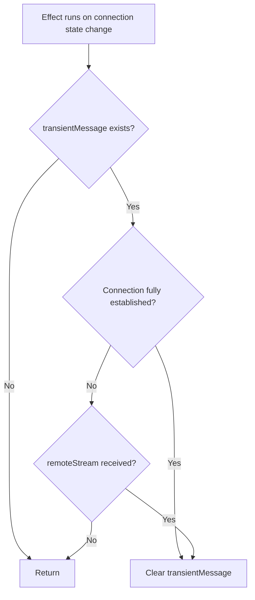

**"Fully established" means**: `callStatus === 'active'` AND `peerConnectionState === 'connected'` AND `iceConnectionState` is `'connected'` or `'completed'`

#### Main Initialization Effect

The core effect that sets up the entire call session:

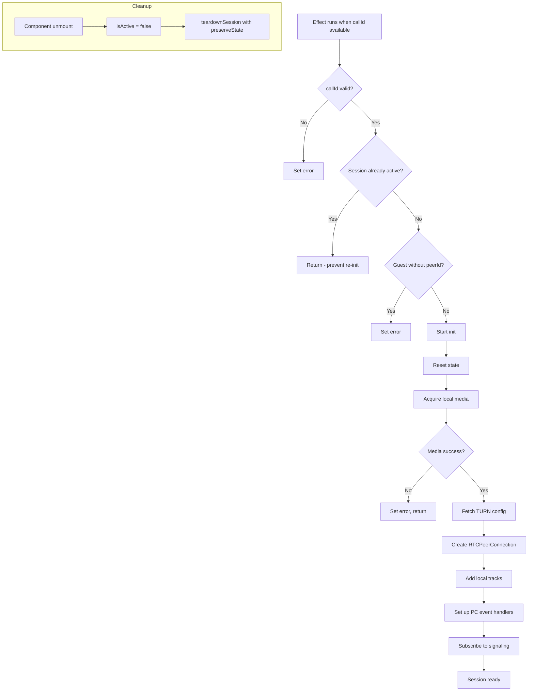

### Signaling Message Handlers

The subscription to signaling sets up handlers for various message types:

| Handler | Trigger | Action |
|---------|---------|--------|
| `onJoin` | Server confirms join | Set wsState='ready', store peer info, handle reconnect flag |
| `onState` | Call state update | Update callStatus, participants, handle call ended |
| `onReconnected` | Peer reconnected | Call handlePeerReconnected() |
| `onOffer` | SDP offer received | Guest calls handleRemoteOffer() |
| `onAnswer` | SDP answer received | Host calls handleRemoteAnswer() |
| `onIceCandidate` | ICE candidate received | Call handleRemoteCandidate() |
| `onLeave` | Peer left call | Start 30s disconnect timer |
| `onMessage` | Generic message | Handle peer-disconnected/peer-reconnected |
| `onClose` | WebSocket closed | Set wsState='disconnected' |
| `onError` | WebSocket error | Set wsState='disconnected' |

### RTCPeerConnection Event Handlers

| Event | Handler Logic |
|-------|---------------|
| `onicecandidate` | Send candidate to remote peer via signaling |
| `ontrack` | Set remoteStream when media track received |
| `onconnectionstatechange` | Update peerConnectionState, set error on 'failed' |
| `oniceconnectionstatechange` | Complex reconnection logic (see below) |

#### ICE Connection State Handler Logic

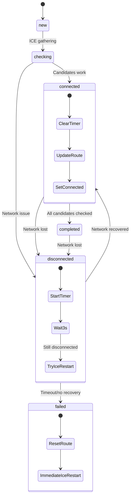

### Cleanup and Resource Management

The hook implements careful resource management:

1. **isActive flag**: Prevents state updates after unmount
   ```typescript
   let isActive = true;
   // ... in async operations:
   if (!isActive) return;
   // ... in cleanup:
   isActive = false;
   ```

2. **Timer cleanup**: All timers are cleared on teardown
3. **Event handler cleanup**: All PC handlers are nullified before close
4. **Media release**: Local tracks are stopped via `releaseLocalStream()`

### Stale Closure Prevention

The hook uses several techniques to avoid stale closure bugs:

1. **Ref-based function**: `createOfferRef` allows calling from effects
2. **connectionParamsRef**: Synced with state via effect
3. **isActive flag**: Checked in all async operations
4. **Refs for WebRTC objects**: Accessed directly, not via closure
